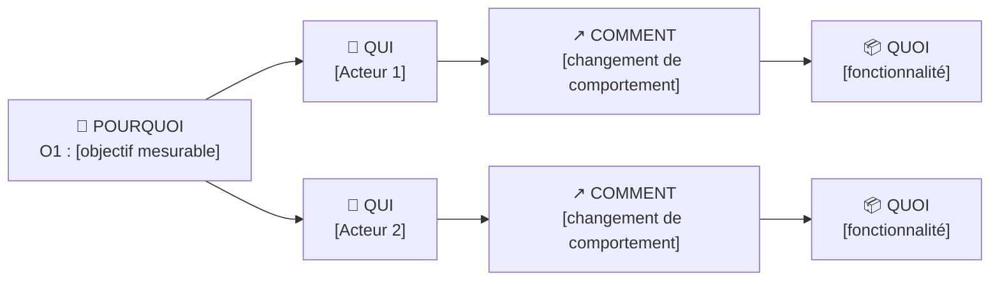

# Impact Map

Statut : Brouillon

Chaque fonctionnalité doit remonter à un objectif. Sinon, elle sort du périmètre.

## Priorisation (MoSCoW)
| Fonctionnalité | Objectif | Impact visé | Priorité | Lot |
|---|---|---|---|---|
| | O1 | | Must | Lot 1 |
