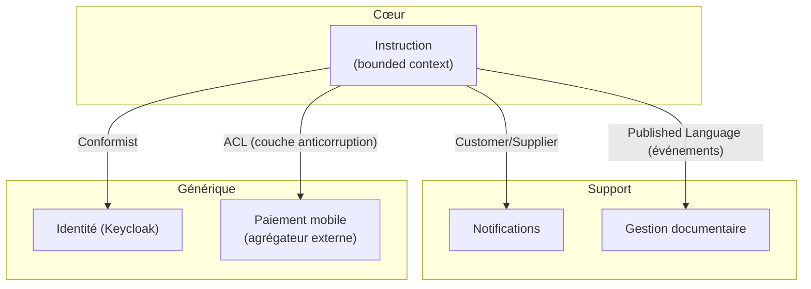

# Sous-domaines et context map

Statut : Brouillon

## Classification des sous-domaines
| Sous-domaine | Type | Justification | Stratégie |
|---|---|---|---|
| [ex. Instruction des demandes] | **Cœur** | Différenciant, règles complexes | Développement sur mesure, DDD tactique |
| [ex. Gestion des utilisateurs] | Générique | Commun à tous les SI | Keycloak / solution existante |
| [ex. Notifications] | Support | Nécessaire, pas différenciant | CRUD simple / service tiers |

> Règle : l'effort de conception (DDD tactique, tests poussés) va **au cœur**. Le reste
> se fait au plus simple ou s'achète.

## Context map

## Relations
| Amont | Aval | Pattern | Contrat | Remarques |
|---|---|---|---|---|
| Paiement externe | Instruction | ACL | API agrégateur | Isoler les spécificités de l'opérateur |
