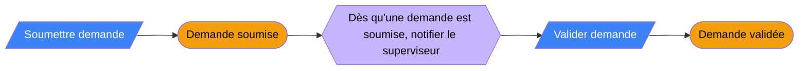

# Compte rendu d'Event Storming

Type : Big Picture / Process Level · Date : · Participants :
Photos du mur : `docs/01-domaine/photos/` · Outil : [Miro / papier]

## Légende
| Couleur | Élément | Formulation |
|---|---|---|
| 🟧 Orange | Événement métier | Participe passé : « Demande soumise » |
| 🟦 Bleu | Commande | Impératif : « Soumettre la demande » |
| 🟨 Jaune | Acteur | « Agent de guichet » |
| 🟪 Lilas | Politique / règle | « Dès que…, alors… » |
| 🟩 Vert | Vue / information | « Liste des demandes en attente » |
| 🩷 Rose | Système externe | « Plateforme de paiement mobile » |
| 🟥 Rouge | Point chaud / question | « Qui valide au-delà de 5 M FCFA ? » |

## Flux principal (chronologique)

## Événements pivots (changements de phase)
1.
2.

## Points chauds à résoudre
| # | Question | Responsable | Échéance | Réponse |
|---|---|---|---|---|
| H1 | | | | |

## Candidats bounded contexts identifiés
→ reportés dans `context-map.md`
